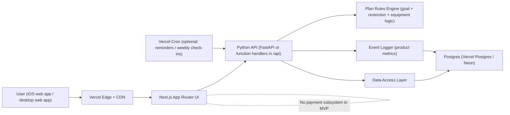
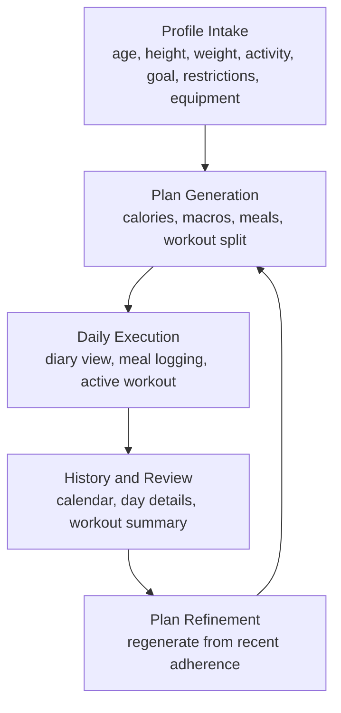
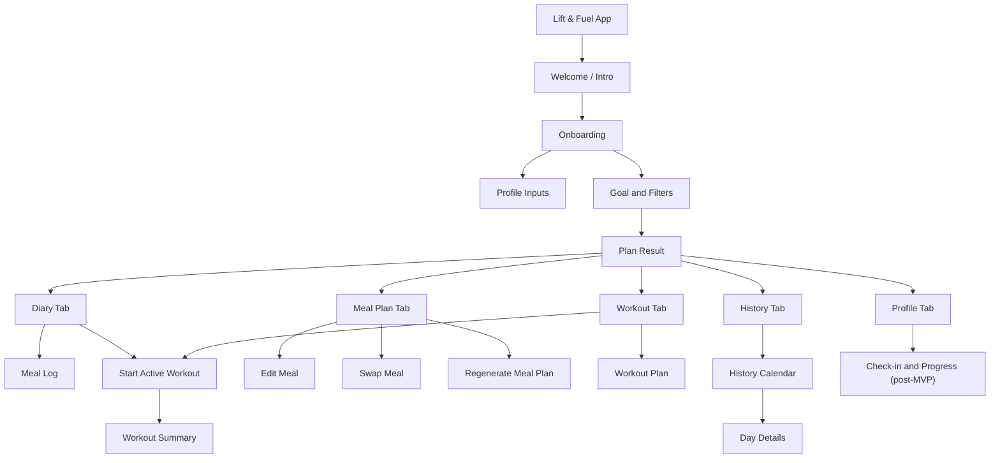
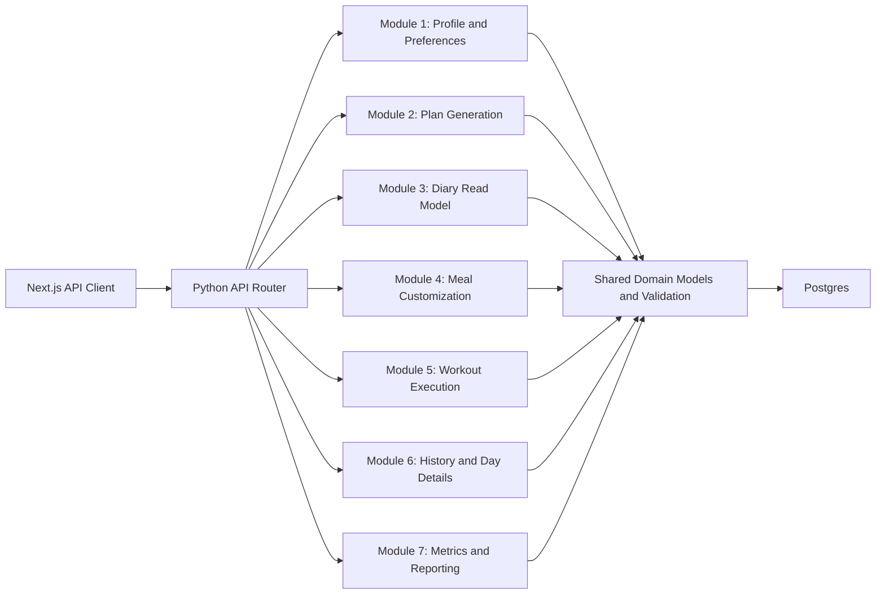
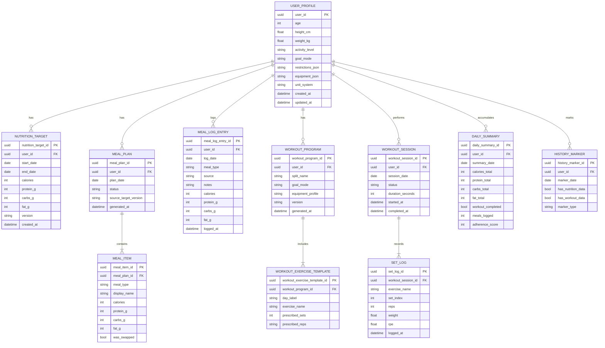
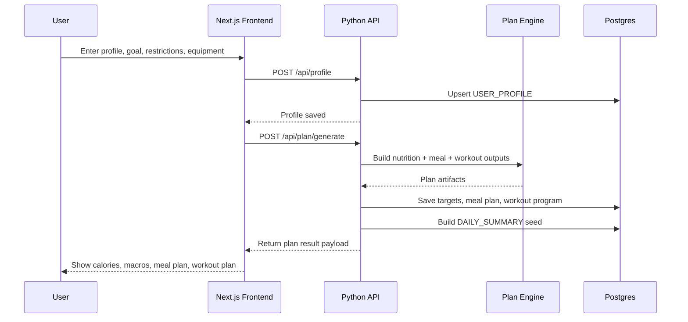
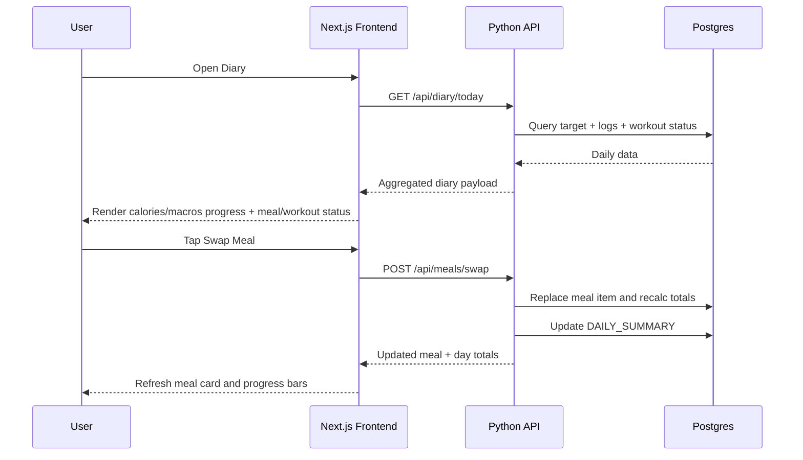
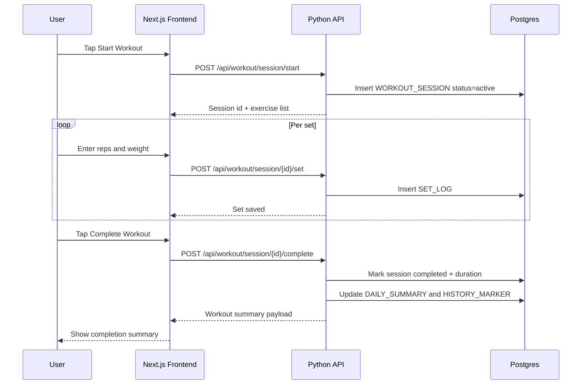
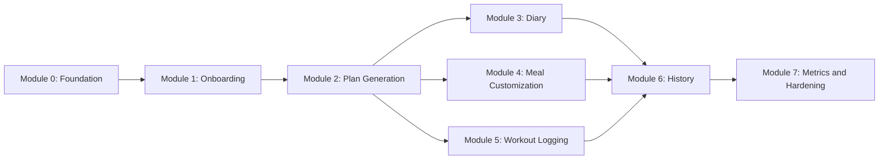

# Lift & Fuel Architecture Blueprint

This document converts the whitepaper into a concrete build blueprint for a demo MVP.

## 1. Scope and constraints

- Source of truth: `lift_fuel_product_whitepaper_2.pdf`.
- Screenshots are treated as UI intent only and may have inaccuracies.
- Frontend: Next.js (App Router).
- Backend: Python API on Vercel serverless functions.
- Hosting: Vercel.
- No payments or billing in MVP.
- Product objective: one closed daily loop (plan, execute, log, review).

## 2. Deployment architecture (Vercel + Next.js + Python)



## 3. Product closed loop (from whitepaper)



## 4. Page map and navigation architecture



## 5. Backend module architecture



## 6. Product data model (ER)



## 7. Core API surface (MVP)

| Domain | Method | Endpoint | Purpose |
|---|---|---|---|
| Profile | `POST` | `/api/profile` | Create profile + preferences |
| Profile | `PATCH` | `/api/profile/{user_id}` | Update profile fields |
| Plan | `POST` | `/api/plan/generate` | Generate nutrition targets + meal plan + workout program |
| Plan | `POST` | `/api/plan/regenerate` | Regenerate meal or workout block |
| Diary | `GET` | `/api/diary/today?user_id=...` | Return merged daily dashboard payload |
| Meals | `POST` | `/api/meals/log` | Manual meal/snack logging |
| Meals | `POST` | `/api/meals/swap` | Swap one meal and recompute totals |
| Meals | `PATCH` | `/api/meals/{meal_item_id}` | Edit meal macros or name |
| Workout | `GET` | `/api/workout/today?user_id=...` | Get today's workout session template |
| Workout | `POST` | `/api/workout/session/start` | Start active workout session |
| Workout | `POST` | `/api/workout/session/{session_id}/set` | Log set-by-set performance |
| Workout | `POST` | `/api/workout/session/{session_id}/complete` | Complete session + summary |
| History | `GET` | `/api/history/calendar?user_id=...&month=YYYY-MM` | Calendar markers |
| History | `GET` | `/api/history/day?user_id=...&date=YYYY-MM-DD` | Daily nutrition + workout details |
| Metrics | `POST` | `/api/metrics/event` | Track product events |

## 8. Key sequence diagrams

### 8.1 Onboarding and plan generation



### 8.2 Daily diary open and meal swap



### 8.3 Active workout logging and completion



## 9. Module-by-module build instructions

### Module 0: Platform foundation

- Frontend tasks
  - Initialize Next.js App Router project structure.
  - Create shell layout with bottom nav placeholders: Diary, Meal Plan, Workout, History, Profile.
  - Build shared UI primitives for progress bars, cards, section headers, and action buttons.
- Backend tasks
  - Create Python API entrypoint and router scaffold.
  - Add health endpoint and request validation layer.
  - Add DB connection and migration tooling.
- Data tasks
  - Create base tables for user profile and timestamps.
- Definition of done
  - Deployable to Vercel with working `/api/health`.

### Module 1: Onboarding and profile capture

- Frontend tasks
  - Build onboarding flow: profile inputs then goal and filters.
  - Add form validation and save states.
- Backend tasks
  - Implement `POST /api/profile` and `PATCH /api/profile/{user_id}`.
  - Validate required completeness fields from whitepaper rules.
- Data tasks
  - Finalize `USER_PROFILE` schema.
- Definition of done
  - Plan generation is blocked until required fields are complete.

### Module 2: Plan generation engine

- Frontend tasks
  - Build plan result screen with calorie and macro target cards.
  - Add entry points to meal plan and workout plan tabs.
- Backend tasks
  - Implement `POST /api/plan/generate`.
  - Add rules for goal modes: lose, maintain, build, consistency.
  - Return beginner-friendly workout structure and 3-meal baseline plan.
- Data tasks
  - Persist `NUTRITION_TARGET`, `MEAL_PLAN`, `MEAL_ITEM`, `WORKOUT_PROGRAM`, `WORKOUT_EXERCISE_TEMPLATE`.
- Definition of done
  - User gets visible calorie/macro targets plus meal and workout output in one response.

### Module 3: Diary dashboard (daily home)

- Frontend tasks
  - Build Diary screen from screenshot model: calorie/macro progress, meal status, workout status.
  - Add quick action buttons for meal logging and start workout.
- Backend tasks
  - Implement `GET /api/diary/today` with merged read model.
  - Implement `POST /api/meals/log` for off-plan meals.
- Data tasks
  - Persist `MEAL_LOG_ENTRY` and `DAILY_SUMMARY`.
- Definition of done
  - Logging any meal immediately updates diary totals.

### Module 4: Meal planning and customization

- Frontend tasks
  - Build meal cards with Edit and Swap actions.
  - Add regenerate meal plan action.
- Backend tasks
  - Implement `PATCH /api/meals/{meal_item_id}` and `POST /api/meals/swap`.
  - Implement `POST /api/plan/regenerate` for meal-only refresh.
  - Recompute per-meal and per-day totals after any modification.
- Data tasks
  - Track swap metadata and versioning.
- Definition of done
  - User can personalize meals without losing clarity on daily macro totals.

### Module 5: Workout planning and active logging

- Frontend tasks
  - Build Workout tab list and Active Workout logger.
  - Build Workout Summary page.
- Backend tasks
  - Implement session start, set logging, and session complete endpoints.
  - Ensure equipment filters are honored in generated exercise list.
- Data tasks
  - Persist `WORKOUT_SESSION` and `SET_LOG`.
- Definition of done
  - Set-by-set logging works in-session and summary appears on completion.

### Module 6: History and day details

- Frontend tasks
  - Build monthly history calendar with logged-day markers.
  - Build Day Details screen with nutrition totals + workout summary.
- Backend tasks
  - Implement history calendar and day details endpoints.
  - Materialize markers from existing logs.
- Data tasks
  - Persist `HISTORY_MARKER` updates.
- Definition of done
  - Any logged day is visible in calendar and drill-down supports both nutrition and workout data.

### Module 7: Product metrics and hardening

- Frontend tasks
  - Track critical product events from UI actions.
- Backend tasks
  - Implement event ingest endpoint and analytics query views.
  - Add guardrails for duplicate submissions and stale writes.
- Data tasks
  - Store events needed for whitepaper metrics.
- Definition of done
  - You can report onboarding completion, plan generation completion, diary opens, workouts completed, meal log frequency, and days with complete data.

## 10. Build dependency graph



## 11. Suggested repo layout

```text
/
  app/                              # Next.js App Router pages
    (tabs)/
      diary/page.tsx
      meal-plan/page.tsx
      workout/page.tsx
      history/page.tsx
      profile/page.tsx
    onboarding/page.tsx
    plan-result/page.tsx
  components/
  lib/
    api-client.ts
    types.ts
  api/
    index.py                        # Python ASGI app entrypoint
    routers/
      profile.py
      plan.py
      diary.py
      meals.py
      workout.py
      history.py
      metrics.py
    services/
      rules_engine.py
      meal_service.py
      workout_service.py
      history_service.py
    db/
      models.py
      repositories.py
      migrations/
```

## 12. Ticket-ready acceptance checklist

- User cannot generate plan until required profile fields are complete.
- Generated plan always includes visible calorie, protein, carbs, fat targets.
- Meal edits/swaps immediately update meal-level and day-level totals.
- Active workout supports set-by-set actual performance logging.
- Diary unifies nutrition and workout status on one screen.
- History calendar marks logged days and opens day details.
- Product metrics map to whitepaper success criteria.

## 13. Explicitly out of scope for MVP

- Payments, subscriptions, and premium access control.
- Advanced adaptive recommendation engine.
- Coach marketplace or social feed.
- Deep wearable integrations.

