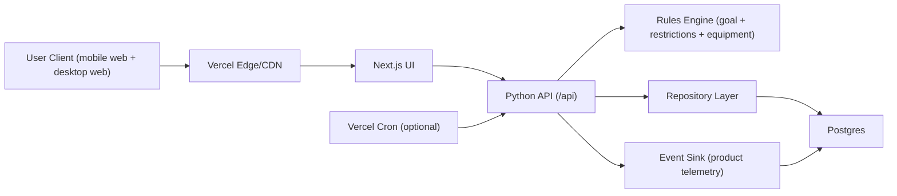
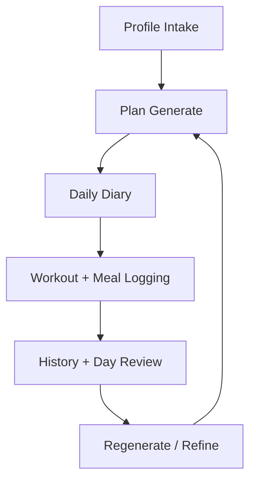
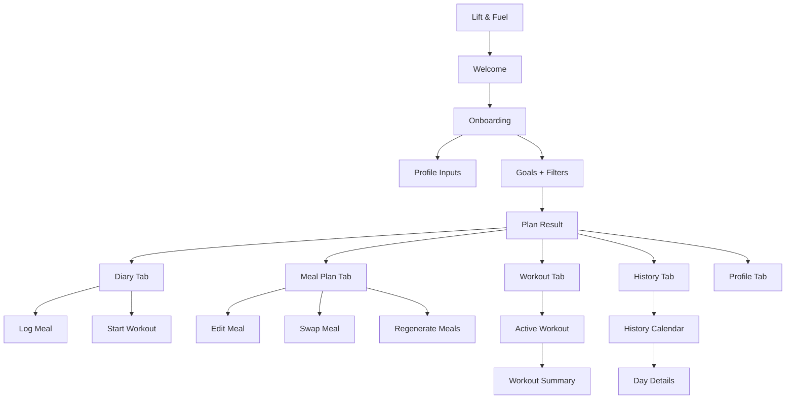
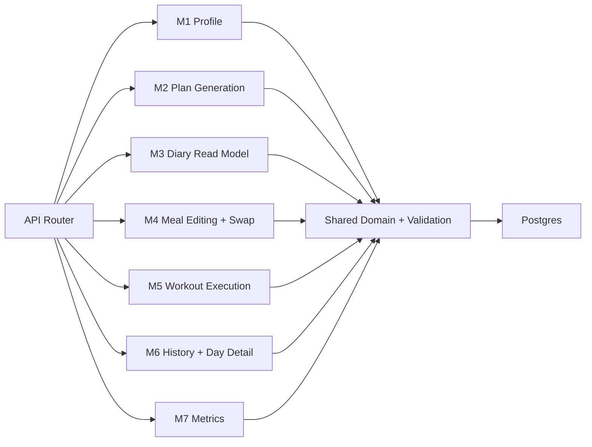
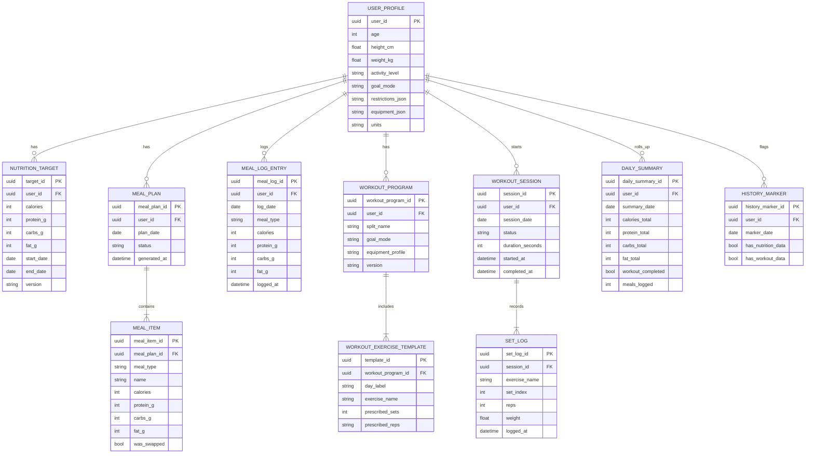
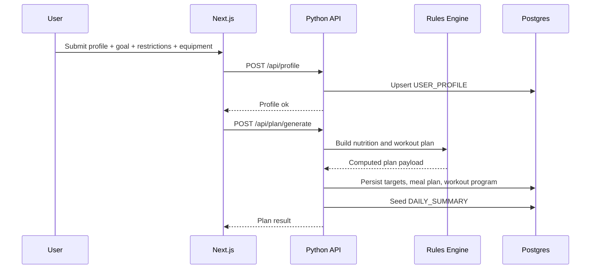
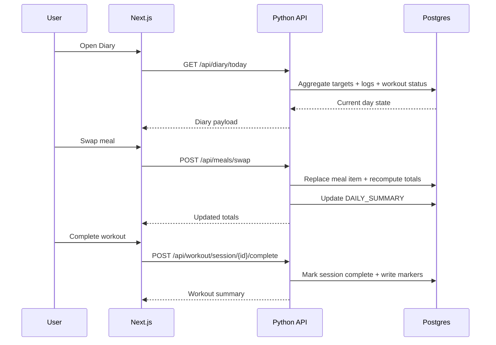
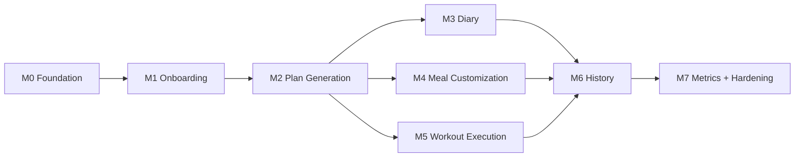

# Lift & Fuel Build Blueprint

## 0) Straight talk


What we are building:
- A demo MVP that gets users from profile input to daily execution with minimal friction.
- One tight loop: generate plan -> do the day -> log it -> review it.

What we are not building right now:
- Payments
- Subscription gates
- Fancy adaptive recommendation system
- Social features

If it does not improve the daily loop, it can wait.

## 1) Stack call

- Frontend: Next.js App Router
- Backend: Python API on Vercel (`/api` functions)
- DB: Postgres (Vercel Postgres or Neon)
- Hosting: Vercel
- Auth (MVP): lightweight session or demo user id, no heavyweight auth wall needed for first pass

## 2) High-level architecture



## 3) Product loop (the thing we actually optimize)



## 4) App map and navigation



## 5) Backend module cut lines



## 6) Data model (MVP)



## 7) API surface (MVP)

| Domain | Method | Route | Notes |
|---|---|---|---|
| Profile | `POST` | `/api/profile` | Create first profile |
| Profile | `PATCH` | `/api/profile/{user_id}` | Update profile/preferences |
| Plan | `POST` | `/api/plan/generate` | Generate targets + meals + workout |
| Plan | `POST` | `/api/plan/regenerate` | Regenerate meals or workout |
| Diary | `GET` | `/api/diary/today?user_id=...` | Read-model for home screen |
| Meals | `POST` | `/api/meals/log` | Manual meal/snack logging |
| Meals | `PATCH` | `/api/meals/{meal_item_id}` | Edit one meal |
| Meals | `POST` | `/api/meals/swap` | Swap meal and recalc totals |
| Workout | `GET` | `/api/workout/today?user_id=...` | Today session template |
| Workout | `POST` | `/api/workout/session/start` | Create active session |
| Workout | `POST` | `/api/workout/session/{session_id}/set` | Append set result |
| Workout | `POST` | `/api/workout/session/{session_id}/complete` | Close session + summary |
| History | `GET` | `/api/history/calendar?user_id=...&month=YYYY-MM` | Monthly markers |
| History | `GET` | `/api/history/day?user_id=...&date=YYYY-MM-DD` | Nutrition + workout details |
| Metrics | `POST` | `/api/metrics/event` | Product analytics events |

## 8) Critical flows

### 8.1 Onboarding -> plan generation



### 8.2 Diary + meal swap + workout complete



## 9) Module shipping plan (do this in order)

### M0 Foundation

- Set up Next.js shell and tab layout.
- Stand up Python `/api` router with `/api/health`.
- Wire Postgres connection and migrations.
- Add request/response schemas so payloads are stable.

Done when:
- We can deploy on Vercel and hit `/api/health` from UI.

### M1 Onboarding + Profile

- Build profile/goal/filter flow.
- Block plan generation until required fields are filled.
- Save profile via `POST /api/profile`.

Done when:
- New user can complete onboarding without dead ends.

### M2 Plan Generation

- Implement deterministic rules for goal modes (`lose`, `maintain`, `build`, `consistency`).
- Return calories/macros plus baseline 3-meal plan and workout split.
- Persist generated artifacts with version tags.

Done when:
- One request returns a full starting plan the user can execute today.

### M3 Diary Home (hot path)

- Build merged daily dashboard (calorie/macros + meal status + workout status).
- Implement manual meal logging.
- Keep response fast; this is the highest-frequency read path.

Done when:
- Diary reflects updates immediately after log events.

### M4 Meal Editing + Swap

- Edit meal values and swap meals without breaking day totals.
- Recompute per-meal and per-day totals server-side.
- Track swap metadata for history/debug.

Done when:
- Users can customize meals and still trust the macro math.

### M5 Workout Execution

- Start active session, log sets, complete session.
- Persist actuals, not just completion booleans.
- Generate clean workout summary output.

Done when:
- In-session logging feels fast and does not drop set data.

### M6 History + Day Detail

- Build monthly calendar markers from real logged data.
- Build day details page for nutrition totals and workout recap.

Done when:
- Any logged day is visible and drill-down works.

### M7 Metrics + Hardening

- Capture product events for funnel and retention checks.
- Add idempotency checks for duplicate submissions.
- Add basic retries and error surfaces for flaky mobile networks.

Done when:
- We can report the key whitepaper metrics with real data.

## 10) Module dependencies



## 11) Repo skeleton

```text
LiftFuelApp/
  app/
    (tabs)/
      diary/page.tsx
      meal-plan/page.tsx
      workout/page.tsx
      history/page.tsx
      profile/page.tsx
    onboarding/page.tsx
    plan-result/page.tsx
  api/
    index.py
    routers/
      profile.py
      plan.py
      diary.py
      meals.py
      workout.py
      history.py
      metrics.py
    services/
      rules_engine.py
      meal_service.py
      workout_service.py
      history_service.py
    db/
      models.py
      repositories.py
      migrations/
  components/
  lib/
    api-client.ts
    types.ts
  docs/
    LIFT_FUEL_BUILD_BLUEPRINT.md
```

## 12) Acceptance checklist

- Required profile fields gate plan generation.
- Generated plan always shows calories + protein + carbs + fat.
- Meal edit/swap always updates day totals in real time.
- Workout flow stores per-set actual performance.
- Diary unifies nutrition and workout state on one screen.
- History marks logged days and opens day details.
- Metrics cover onboarding, plan completion, diary opens, workout completes, and full-day logs.
